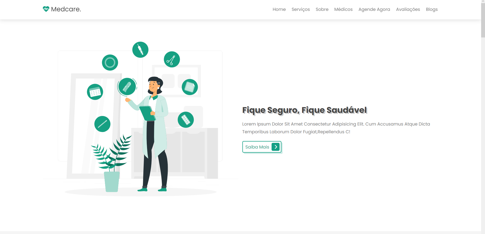

<h1 align="center"> MedCare Projeto </h1>

  <a href="#-tecnologias">Tecnologias</a>&nbsp;&nbsp;&nbsp;|&nbsp;&nbsp;&nbsp;
  <a href="#-projeto">Projeto</a>&nbsp;&nbsp;&nbsp;|&nbsp;&nbsp;&nbsp;
  <a href="#memo-licença">Licença</a>

  

 

  

## 🚀 Tecnologias

Esse projeto foi desenvolvido com as seguintes tecnologias:

- HTML e CSS
- JavaScript
- Git e Github

## 💻 Projeto

Landing Page de serviços hospitalares.

- [Acesse o projeto finalizado, online](https://thegabrielsena.github.io/projeto01/)

## 🪪 Licença

Esse projeto está sob a licença MIT.

---

Feito com ♥ por sena_thegreat
